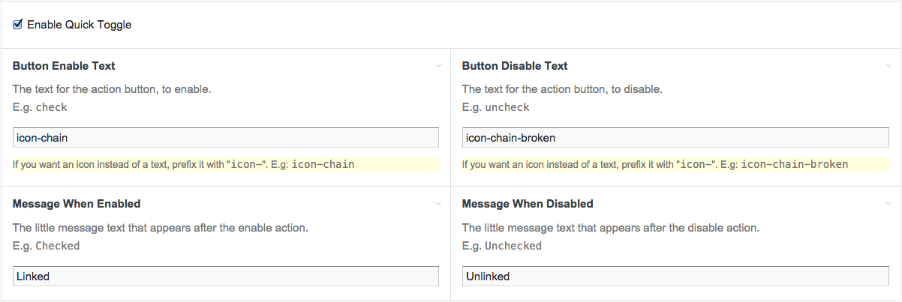

ProcessQuickToggle
==================

Quickly toggle your checkboxes with extra action buttons via AJAX.

The module adds functionality to InputfieldCheckbox so you can toggle the checkbox
fields in the extra action buttons intruduced in [ProcessWire 2.6.5][pw-2-6-5] via AJAX.

## Requirements
This module works only for ProcessWire versions later than 2.6.5.

## How to Install
1. Copy the files in this directory to /site/modules/ProcessQuickToggle/ 

2. In your admin, go to Modules > Refresh for new modules. 

3. Click the "Install" button next to Process Quick Toggle.

## Usage
Go to any checkbox field you want to enable quick toggle feature for
_Setup > Fields > my_checkbox_field_. There in the `Input` tab you should see an
_Enable Quick Toggle_ field. After you check it you will see some fields that you
can fill based on your needs.

Then save the field. Now there should be an extra button for every page 
that has this field in the Pages tree.

## Features 
  - Supports template contexts.
  - Supports core FontAwesome icons.

[pw-2-6-5]: http://processwire.com/blog/posts/extra-action-in-your-page-list-processwire-core-updates-2.6.5/